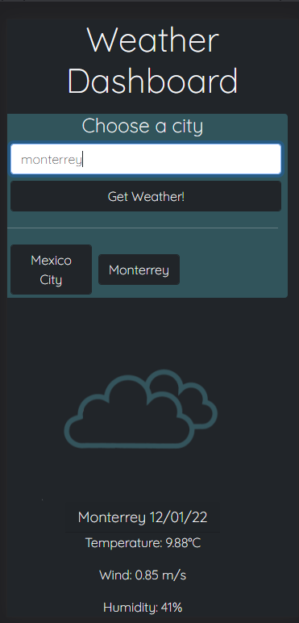

# Weather Dashboard

by Cesar San.

Contact me by Email: cesanchezesc@gmail.com

List of Technologies:

-HTML.

-CSS.

-Bootstrap

-Javascript.

-APIs.

Weather Dashboard gives you your local weather (Free geolocation API is blocked by github) and let you look for the weather forecast of any city.

The task was to create a weather app in which you could enter a city and get the current weather and a five day weather forecast using API's and dinamic html and css.

To accomplish this objective, the weather API documentation was reviewed first to plan what information was to be shown and how. Then the html structure was built along with the base files. I decided to add a geolocation API so that, when the webpage was first loaded, instead of being empty, it uses the html5 built-in geolocation data as well as an API to find a city with the given information. After a few problems with unsecure http in github were fixed, this was done. *Update: the free API was blocked again* Then, the javascript for building each weather card was done without a problem. While working on both the html and the javascript files, some format was added, but it was until everything else was finished that the css was polished. After a few problems with the weather images not scaling properly were fixed, the app was done. 

 [Final Product:Github repository](https://github.com/csancheze/Weather-Dashboard/)

 [Final Product:Weather Dashboard](https://csancheze.github.io/Weather-Dashboard/)
 
 [Google Drive Files](https://drive.google.com/drive/folders/1ht9ym3LlYIKZn5AgRQ3c3PLgnrz_F_yR?usp=sharing)

Copyright (c) [2022] [Cesar San]

Permission is hereby granted, free of charge, to any person obtaining a copy
of this software and associated documentation files (the "Software"), to deal
in the Software without restriction, including without limitation the rights
to use, copy, modify, merge, publish, distribute, sublicense, and/or sell
copies of the Software, and to permit persons to whom the Software is
furnished to do so, subject to the following conditions:

The above copyright notice and this permission notice shall be included in all
copies or substantial portions of the Software.

THE SOFTWARE IS PROVIDED "AS IS", WITHOUT WARRANTY OF ANY KIND, EXPRESS OR
IMPLIED, INCLUDING BUT NOT LIMITED TO THE WARRANTIES OF MERCHANTABILITY,
FITNESS FOR A PARTICULAR PURPOSE AND NONINFRINGEMENT. IN NO EVENT SHALL THE
AUTHORS OR COPYRIGHT HOLDERS BE LIABLE FOR ANY CLAIM, DAMAGES OR OTHER
LIABILITY, WHETHER IN AN ACTION OF CONTRACT, TORT OR OTHERWISE, ARISING FROM,
OUT OF OR IN CONNECTION WITH THE SOFTWARE OR THE USE OR OTHER DEALINGS IN THE
SOFTWARE.
