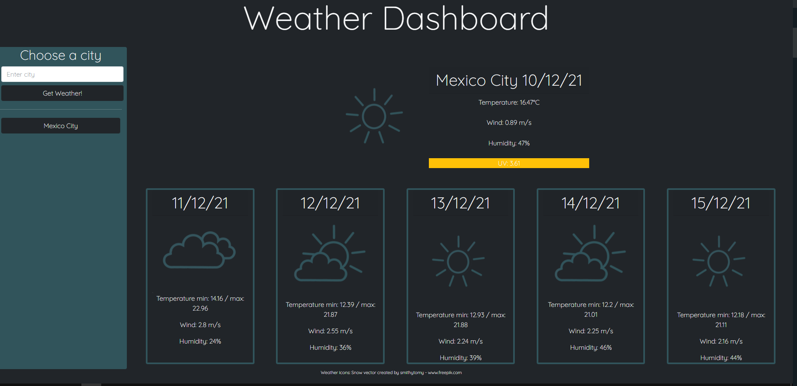

# Weather-Dashboard

by Cesar San.

Contact me by Email: cesanchezesc@gmail.com

List of Technologies:

-HTML.

-CSS.

-Bootstrap

-Javascript.

-APIs.

NXT movie is an app to look for a movie and get the streaming services you can use to watch it.

The task was to create a weather app in which you could enter a city and get the current weather and a five day weather forecast using API's and dinamic html and css.

To accomplish this objective, the weather API documentation was reviewed first to plan what information was to be shown and how. Then the html structure was built along with the base files. I decided to add a geolocation API so that, when the webpage was first loaded, instead of being ampty, it uses the html5 built-in geolocation data as well as an API to find a city with the given information. After a few problems with unsecure http in github were fixed, this was done. Then, the javascript for building each weather card was done without a problem. While working on both the html and the javascript files, some format was added, but it was until everything else was finished that the css was polished. After a few problems with the weather images not scaling properly were fixed, the app was done. 

 [Final Product:Github repository](https://github.com/csancheze/Weather-Dashboard/)

 [Final Product:Weather Dashboard](https://csancheze.github.io/Weather-Dashboard/)
 
 [Google Drive Files](https://drive.google.com/drive/folders/1ht9ym3LlYIKZn5AgRQ3c3PLgnrz_F_yR?usp=sharing)
